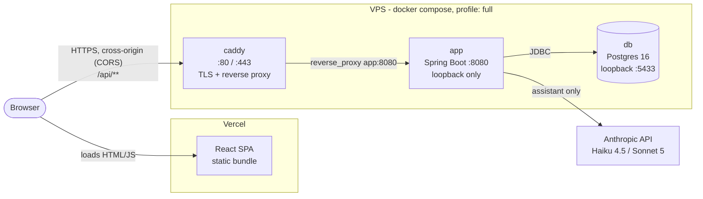
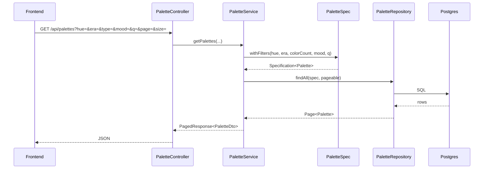
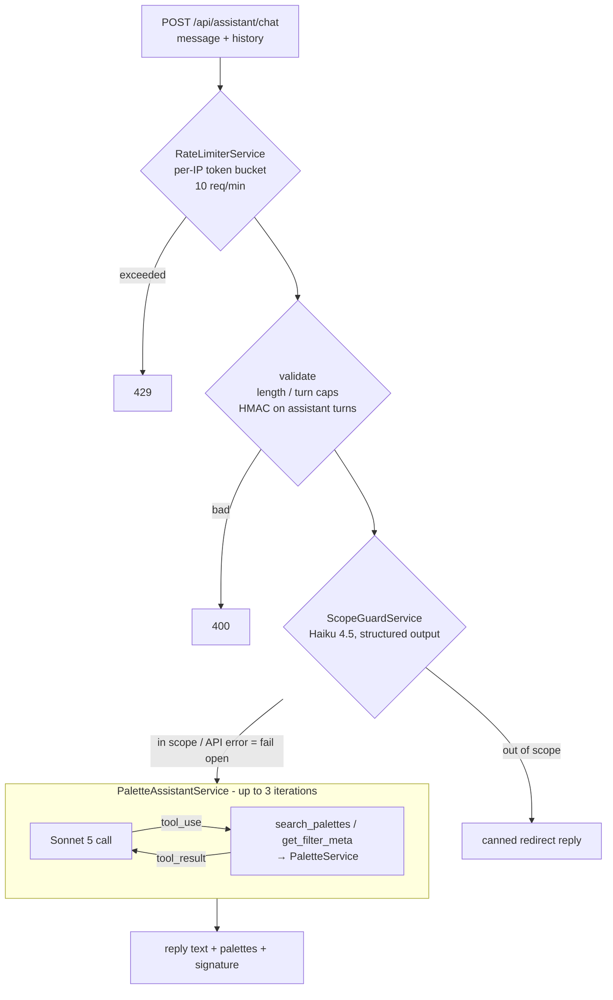
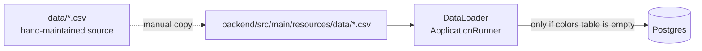

# Architecture

How Kasane fits together, end to end. For day-to-day conventions see `AGENTS.md`
(full-stack), `frontend/AGENTS.md`, and `backend/AGENTS.md`.

Kasane is a reference browser for traditional Japanese color combinations
(*kasane no irome*): a read-only palette/color API, a React SPA on top of it, and a
Claude-powered conversational palette finder.

## System overview



- The **frontend** and **backend** are on different origins in prod. The browser calls
  the API directly, so CORS (`CorsConfig`, `CORS_ALLOWED_ORIGINS`) is load-bearing,
  not just a dev safety net.
- **Caddy** is the only publicly exposed service. It terminates TLS (Let's Encrypt
  for `API_DOMAIN`, provisioned automatically). TLS is mandatory here, because the
  HTTPS Vercel site can't call a plain-HTTP API (mixed content).
- **app** and **db** publish ports on `127.0.0.1` only. They're reachable from the
  VPS itself for debugging and from other containers by service name, never from
  the internet.

## Backend

Spring Boot 3 / Java 21, Spring Data JPA, Lombok, virtual threads enabled.

```
com.kasane
├── controller/   ColorController, PaletteController   - HTTP only, query params, no logic
├── service/      ColorService, PaletteService          - entity ↔ DTO mapping, paging
├── spec/         PaletteSpec                           - dynamic JPA Specification filters
├── repository/   ColorRepository, PaletteRepository    - Spring Data JPA
├── model/        Color, Palette                        - JPA entities
├── dto/          ColorDto, PaletteDto, PaletteColorDto, PagedResponse, FilterMetaDto
├── config/       CorsConfig, DataLoader
└── assistant/    the palette assistant (separate path, see below)
```

### Read path (browse and detail)



| Endpoint | Purpose |
|---|---|
| `GET /api/palettes` | Paged, filterable list (`hue`, `era`, `type` = color count, `mood`, `q` free text) |
| `GET /api/palettes/meta` | Distinct filter values that actually exist (`FilterMetaDto`) |
| `GET /api/palettes/{slug}` | One palette |
| `GET /api/colors`, `GET /api/colors/{slug}` | Paged colors / one color |
| `POST /api/assistant/chat` | Palette assistant (the only non-read endpoint) |

**Data model.** There are two flat tables, `colors` and `palettes`. A palette stores
its 2–4 colors denormalized as `hex1..4` / `colorName1..4` / `colorNameJa1..4`
columns rather than as a join table. That's fine for a fixed, read-only dataset.
`PaletteDto` reshapes them into a `colors: PaletteColorDto[]` list for the API.

### Palette assistant

`com.kasane.assistant` is deliberately separate from the read path. It's a manual
Claude tool-use loop whose tools call straight into the existing `PaletteService`, so
there's no new query logic.



Key properties:

- **Hallucination guardrail.** The `palettes` array in the response is always exactly
  what `search_palettes` last returned that turn (capped at 6), never parsed out of
  the model's prose. The model can describe and rank palettes, but it can't invent
  one.
- **Stateless conversations with integrity.** The server stores no chat history; the
  client resends it each turn. To stop a client from fabricating earlier "assistant"
  turns to steer the model, every reply is HMAC-signed (`HistoryIntegrityService`), and
  assistant turns in incoming history must carry a valid signature. The key is random
  per process start, so a backend restart invalidates in-flight conversations.
- **Cost bounding.** Messages are capped at 1000 chars, history at 20 turns, and the
  loop at 3 tool iterations. The cheap Haiku scope check runs before any Sonnet call.
  `CostTrackingService` logs per-call and running cost (in memory, for visibility only;
  it isn't a billing record).
- **Graceful degradation.** Both Anthropic failure types share the `AnthropicException`
  base, which is caught to return a friendly fallback reply instead of a 500. That
  includes a missing `ANTHROPIC_API_KEY`. The scope guard fails open, since the main
  agent's tools are read-only.
- **Client IP.** The rate limiter keys on `request.getRemoteAddr()`. In prod,
  `server.forward-headers-strategy: native` lets Tomcat rewrite that from
  `X-Forwarded-For` only when the immediate peer is an internal address (Caddy on the
  Docker network). Code must never read `X-Forwarded-For` directly, because it's
  client-controlled. Idle buckets are evicted every 5 minutes.

## Frontend

React 18, TypeScript, Vite, Tailwind, React Router, TanStack React Query.

```
src/
├── App.tsx            QueryClient + routes:  /  → BrowsePage,  /palettes/:slug → DetailPage
├── pages/             BrowsePage (FilterBar + PaletteCard grid), DetailPage
├── components/        PaletteCard, ColorSwatch, FilterBar, PaletteAssistant,
│                      ContrastChecker, CSSExport, OutfitPreview, Layout
├── hooks/usePalettes  React Query hooks - the only thing components use for data
├── services/api.ts    fetch wrapper; BASE = VITE_API_BASE_URL ?? '/api'
├── types/index.ts     hand-mirrored backend DTOs
└── utils/colorUtils   contrast / color math for ContrastChecker etc.
```

Data flows **component → hook → `api.ts` → JSON → `types/index.ts` interfaces**.
Components never call `fetch` directly. `PaletteAssistant` keeps the conversation
(including each reply's `signature`) in client state and resends it on every turn.

**Transport.** In dev, `BASE` is `/api` and Vite proxies `/api/**` to
`localhost:8080`, which makes requests same-origin. In prod, `VITE_API_BASE_URL` is
the absolute API URL **including the `/api` suffix** (request paths in `api.ts` omit
it). It's inlined at build time, so changing it means a Vercel rebuild.
`frontend/vercel.json` rewrites every path to `index.html` so React Router deep links
survive a refresh.

## Data and seeding



- The dataset is derived from colorcombinations.org (CC BY 4.0). See `README.md`.
- Nothing syncs the two CSV copies automatically, so edit both.
- `DataLoader` runs on every boot but seeds only into an empty `colors` table. Data
  then persists in the `kasane-db-data` volume; `docker compose down -v` forces a
  reseed.
- Schema comes from Hibernate `ddl-auto: update` (no Flyway/Liquibase).
- Tests use H2 in-memory with `create-drop`, independent of the dev database.

## Environments

| | Dev | Prod (VPS + Vercel) |
|---|---|---|
| Frontend | `yarn dev` (Vite :5173, `/api` proxy) | Vercel static build, root `frontend` |
| Backend | `./gradlew bootRun` (`application.yml`) | `app` container, `SPRING_PROFILES_ACTIVE=prod` |
| Database | `docker compose up -d` → `db` only, `localhost:5433` | `db` container, same compose file |
| TLS / ingress | none | `caddy` container, `API_DOMAIN` |
| Secrets | exported shell vars (`bootRun` ignores `.env`) | `.env` next to `docker-compose.yml` on the VPS |

One `docker-compose.yml` serves both. A plain `up` gives only `db`; `--profile full`
adds `app` and `caddy`, the exact production shape. The full env var table lives in
`AGENTS.md`.

## Design decisions and tradeoffs

| Decision | Why | Cost / revisit when |
|---|---|---|
| Single VPS + Vercel instead of AWS (S3/CloudFront/EC2/RDS) | Cheap and simple at pet-project scale | No managed backups or failover. Run a `pg_dump` cron if the data matters |
| Hibernate `ddl-auto: update`, no migrations | Additive, low-churn schema; fewer moving parts | Renames and drops aren't handled. Adopt Flyway before risky schema changes |
| In-memory rate limiter, cost tracker, and HMAC key | Single instance; no Redis needed | Resets on restart; doesn't work across multiple instances |
| Hand-synced FE types (no OpenAPI codegen) | Small, stable DTO surface | Drift risk. Mirror any `dto/*.java` change in `types/index.ts` in the same commit |
| Denormalized palette colors (`hex1..4`) | Fixed read-only dataset, max 4 colors | Would need a join table if palettes became user-editable |
| Manual tool-use loop rather than SDK tool runner | Full control over which results reach the client (the guardrail) | More code to maintain |
| Stateless chat + signed history | No conversation storage or PII on the server | Restarts break in-flight chats |
| Scope guard fails open | Tools are read-only, so a missed check is low-risk; availability wins | Revisit if the assistant ever gets write-capable tools |
| Caddy for TLS | Automatic certificates, two-line config | One more container to run |
